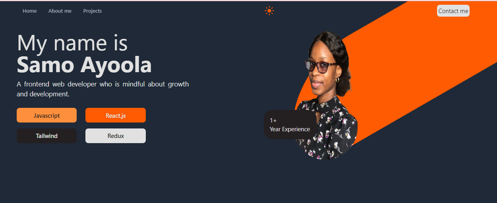

<!-- Please update value in the {}  -->

<h1 align="center">My Portfolio</h1>

  <h3>
    <a href="https://samoayoola.netlify.app/" target="_blank" >
      Demo
    </a>
  </h3>

<!-- TABLE OF CONTENTS -->

## Table of Contents

- [Overview](#overview)
- [Built With](#built-with)
- [Contact](#contact)

<!-- OVERVIEW -->

## Overview

My portfolio was created from scratch using react and Tailwind CSS. It displays information about me and projects I have worked on.

### Built With

<!-- This section should list any major frameworks that you built your project using. Here are a few examples.-->

- [React](https://reactjs.org/)
- [Tailwind](https://tailwindcss.com/)

## Contact
- GitHub [@samoayoola](https://{github.com/samoayoola})
- Linkedin [Samo Ayoola](https://www.linkedin.com/in/ayoolasamo/)

